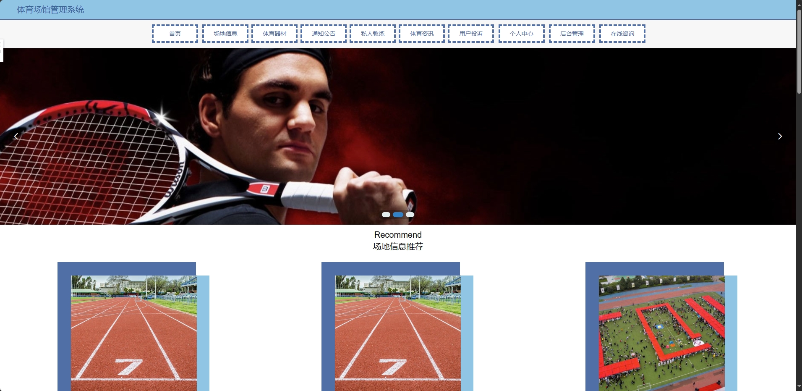
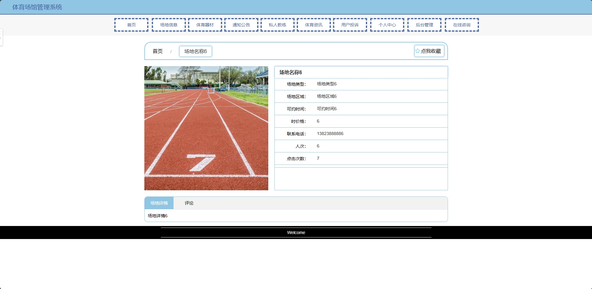
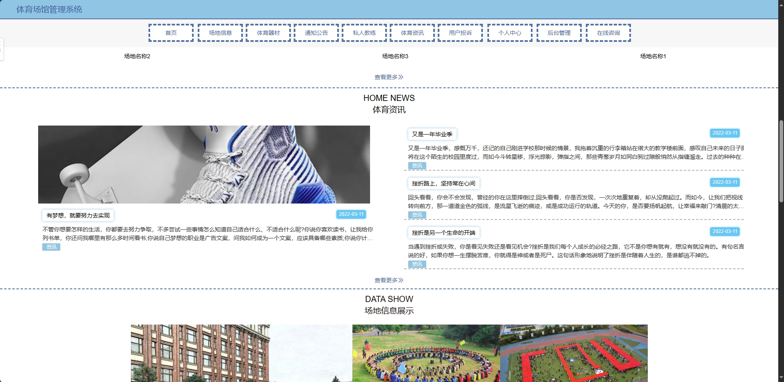
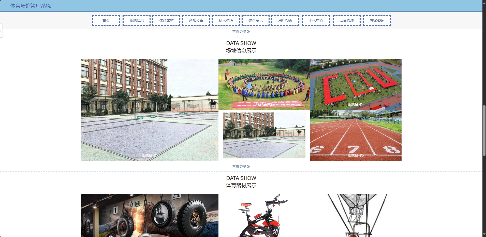
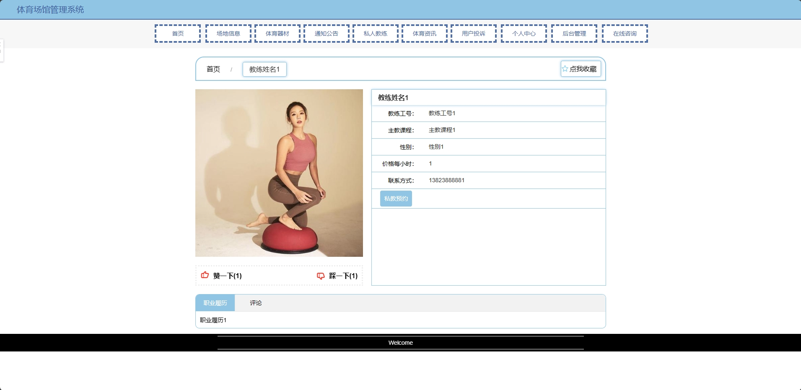
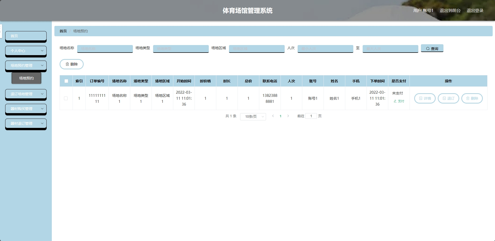
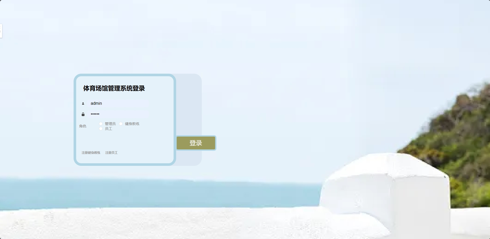

<h1 align="center">基于SSM框架的体育馆场馆预约系统</h1>

<h4> 完整代码获取地址：从戎源码网（https://armycodes.com/） </h4>
<h4> 作者微信：19941326836 QQ：605739993 QQ群：655392706 </h4>
<h4> 承接计算机毕设、Java毕业设计、Python毕业设计、深度学习、机器学习 </h4>
<h4> 选题+开题报告+任务书+程序定制+安装调试+论文+答辩ppt 一条龙服务 </h4>
<h4> 毕业设计所有选题地址：(https://github.com/Descartes007/allProject) </h4>

## 一、项目介绍

基于SSM框架的体育馆场馆预约系统：前端 jsp、ajax、html，后端 springboot、spring、mybatis；角色分为管理员、健身教练、员工、会员和用户；管理员管理后台所有角色信息，对新闻公告进行发布管理，对场地进行发布、场地类型添加、订单进行管理等；教身教练对预约信息进行处理等；员工对投诉信息进行处理等；会员和用户对发布的场地信息进行筛选预约、对体育器材进行购买、对评论咨询查看等。主要功能如下：

### 1、管理员：

- 基本操作：登录、修改密码、获取个人信息、上传图片
- 用户管理：获取用户信息列表、查看用户信息详情、删除用户信息、筛选用户信息、修改用户信息
- 会员管理：获取会员信息列表、查看会员信息详情、删除会员信息、筛选会员信息、修改会员信息
- 健身教练管理：获取健身教练信息列表、查看健身教练信息详情、删除健身教练信息、筛选健身教练信息、修改健身教练信息
- 员工管理：添加员工信息、获取员工信息列表、查看员工信息详情、修改员工信息、删除员工信息、筛选员工信息、员工离职
- 场地类型管理：添加场地类型信息、获取场地类型信息列表、查看场地类型信息详情、修改场地类型信息、删除场地类型信息、筛选场地类型信息
- 场地信息管理：添加场地信息、获取场地信息列表、查看场地信息详情、修改场地信息、删除场地信息、筛选场地信息
- 场地预约管理：获取场地预约信息列表、查看场地预约信息详情、修改场地预约信息、删除场地预约信息、筛选场地预约信息、支付、退订
- 场地退订管理：获取场地退订信息列表、查看场地退订信息详情、修改场地退订信息、删除场地退订信息、筛选场地退订信息、审核、审核回复
- 会员预约管理：获取会员预约信息列表、查看会员预约信息详情、修改会员预约信息、删除会员预约信息、筛选会员预约信息、支付、退订
- 会员退订管理：获取会员退订信息列表、查看会员退订信息详情、修改会员退订信息、删除会员退订信息、筛选会员退订信息、审核、审核回复
- 器材类型管理：添加器材类型信息、获取器材类型信息列表、查看器材类型信息详情、修改器材类型信息、删除器材类型信息、筛选器材类型信息
- 体育器材信息管理：添加体育器材信息、获取体育器材信息列表、查看体育器材信息详情、修改体育器材信息、删除体育器材信息、筛选体育器材信息、器材购买、会员购买、查看评论、回复评论
- 会员退款管理：获取会员退款信息列表、查看会员退款信息详情、修改会员退款信息、删除会员退款信息、筛选会员退款信息、审核、审核回复
- 器材退订管理：获取器材退订信息列表、查看器材退订信息详情、修改器材退订信息、删除器材退订信息、筛选器材退订信息、审核、审核回复
- 通知公告管理：发布通知公告信息、获取通知公告列表、查看通知公告详情、修改通知公告信息、删除通知公告信息
- 私人教练管理：获取私人教练信息列表、查看私人教练信息详情、删除私人教练信息、筛选私人教练信息、修改私人教练信息、私教预约、查看评论、回复评论
- 私教预约管理：获取私教预约信息列表、查看私教预约信息详情、修改私教预约信息、删除私教预约信息、筛选私教预约信息、审核、审核回复
- 会员等级管理：获取会员等级信息列表、查看会员等级信息详情、修改会员等级信息、删除会员等级信息、筛选会员等级信息
- 管理员管理：添加管理员、删除管理员、获取管理员列表、获取管理员详情、修改管理员信息
- 咨询管理：发布咨询信息、获取咨询列表、查看咨询详情、修改咨询信息、删除咨询信息
- 轮播图管理：发布轮播图信息、获取轮播图列表、查看轮播图详情、修改轮播图信息、删除轮播图信息

### 2、健身教练：

- 基本操作：登录、修改密码、获取个人信息、上传图片、注册、在线咨询
- 私人教练管理：获取私人教练信息列表、查看私人教练信息详情、删除私人教练信息、筛选私人教练信息、修改私人教练信息、私教预约、查看评论、回复评论
- 私教预约管理：获取私教预约信息列表、查看私教预约信息详情、修改私教预约信息、删除私教预约信息、筛选私教预约信息、审核、审核回复

### 3、员工：

- 基本操作：登录、修改密码、获取个人信息、上传图片、注册
- 投诉模块：获取投诉列表、查看投诉详情、删除投诉信息、修改投诉信息、回复投诉信息、筛选投诉信息

### 4、会员：

- 基本操作：登录、修改密码、获取个人信息、修改个人信息、上传图片、注册、投诉、在线咨询
- 场地模块：获取场地列表、查看场地信息详情、筛选场地信息、预约、付款、评论、收藏、根据场地类型查询场地
- 体育器材模块：获取体育器材列表、查看体育器材信息详情、筛选体育器材信息、购买、评论、收藏、根据体育器材类型查询场地
- 体育资讯模块：获取体育资讯列表、查看体育资讯信息详情
- 通知公告模块：获取通知公告列表、查看通知公告信息详情
- 私人教练模块：获取私人教练列表、查看私人教练信息详情、筛选私人教练信息、预约、点赞、拉踩、评论、收藏
- 收藏模块：获取收藏列表、取消收藏、查看收藏信息、筛选收藏内容
- 会员预约模块：获取会员预约信息列表、查看会员预约信息详情、删除会员预约信息、筛选会员预约信息、支付、退订
- 会员退订模块：获取会员退订信息列表、查看会员退订信息详情、删除会员退订信息、筛选会员退订信息
- 会员购买模块：获取会员购买信息列表、查看会员购买信息详情、删除会员购买信息、筛选会员购买信息、支付、退款
- 会员退款模块：获取会员退款信息列表、查看会员退款信息详情、删除会员退款信息、筛选会员退款信息
- 私教预约模块：获取私教预约信息列表、查看私教预约信息详情、删除私教预约信息、筛选私教预约信息

### 5、用户：

- 基本操作：登录、修改密码、获取个人信息、修改个人信息、上传图片、注册、投诉、在线咨询
- 场地模块：获取场地列表、查看场地信息详情、筛选场地信息、预约、付款、评论、收藏、根据场地类型查询场地
- 体育器材模块：获取体育器材列表、查看体育器材信息详情、筛选体育器材信息、购买、评论、收藏、根据体育器材类型查询场地
- 体育资讯模块：获取体育资讯列表、查看体育资讯信息详情
- 通知公告模块：获取通知公告列表、查看通知公告信息详情
- 私人教练模块：获取私人教练列表、查看私人教练信息详情、筛选私人教练信息、预约、点赞、拉踩、评论、收藏
- 收藏模块：获取收藏列表、取消收藏、查看收藏信息、筛选收藏内容
- 用户预约模块：获取用户预约信息列表、查看用户预约信息详情、删除用户预约信息、筛选用户预约信息、支付、退订
- 用户退订模块：获取用户退订信息列表、查看用户退订信息详情、删除用户退订信息、筛选用户退订信息
- 用户购买模块：获取用户购买信息列表、查看用户购买信息详情、删除用户购买信息、筛选用户购买信息、支付、退款
- 用户退款模块：获取用户退款信息列表、查看用户退款信息详情、删除用户退款信息、筛选用户退款信息
- 私教预约模块：获取私教预约信息列表、查看私教预约信息详情、删除私教预约信息、筛选私教预约信息

## 二、环境

- <b>IntelliJ IDEA 2020.3</b>

- <b>Mysql 5.7.26</b>
  
- <b>Maven 3.6.3</b>

- <b>Tomcat 9.0.60</b>

- <b>JDK 1.8</b>

## 三、运行截图

